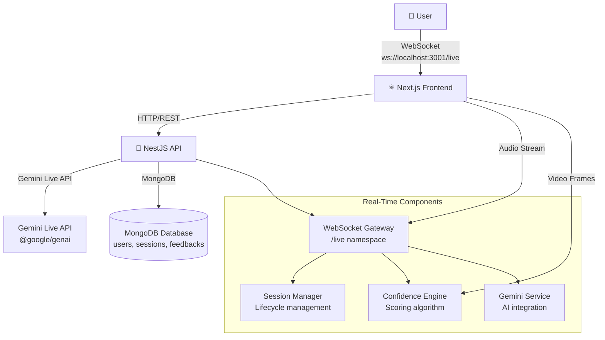
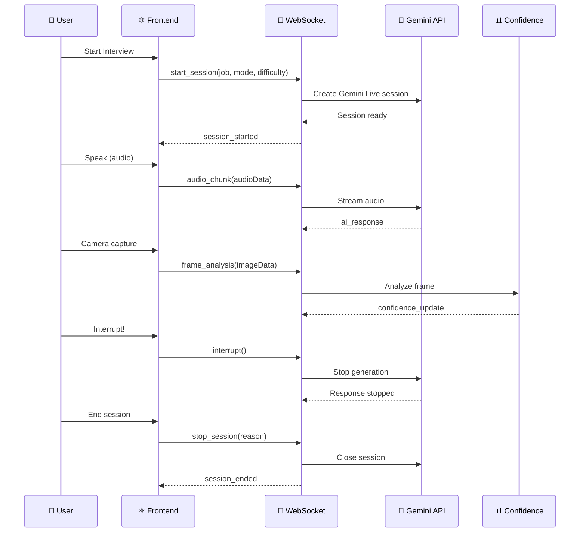

# Live AI Interview Coach - Gemini Live Agent Challenge

## 🎯 Project Overview

**Category:** Live Agents 🗣️
**Track:** Real-time Interaction (Audio/Vision)

**Live AI Interview Coach** is a next-generation AI agent that provides real-time, multimodal interview coaching. Users can have natural voice conversations with the AI while receiving real-time feedback on their confidence, eye contact, posture, and engagement.

### The Problem

Job interviews are stressful, and most people don't get enough practice. Existing solutions are:
- ❌ Text-only chat bots (can't assess delivery)
- ❌ Pre-recorded questions (no real-time adaptation)
- ❌ No feedback on non-verbal cues (confidence, eye contact)
- ❌ Can't interrupt the AI when needed

### Our Solution

An AI-powered interview coach that:
- ✅ **Hears and sees** you in real-time
- ✅ **Adapts questions** based on your responses
- ✅ **Tracks confidence** through video analysis
- ✅ **Handles interruptions** naturally
- ✅ **Provides immediate feedback** after each session

---

## 🚀 Multimodal Features

### 🎤 Real-Time Audio Streaming
```typescript
// Users speak naturally and AI responds in real-time
socket.emit('audio_chunk', { sessionId, audioData: base64Audio });
// AI responds with: ai_response, transcript_partial events
```

### 👁️ Video Frame Analysis
```typescript
// Analyze confidence through computer vision
socket.emit('frame_analysis', { sessionId, frameData: base64Image });
// Returns: { eyeContact, posture, engagement, overall: 0.87 }
```

### 💬 Interruptible Conversations
```typescript
// User can interrupt at any time
socket.emit('interrupt', { sessionId });
// AI gracefully stops and yields to user
```

### 📊 Real-Time Confidence Tracking
- **Eye Contact**: Tracks gaze through webcam
- **Posture**: Analyzes body positioning
- **Engagement**: Measures participation level
- **Overall Score**: Weighted combination of all metrics

---

## 🛠️ Technology Stack

### Mandatory Technologies (Required by Challenge)

| Technology | Usage | Google Service |
|------------|--------|-----------------|
| **Gemini Live API** | Real-time audio/video streaming | ✅ Vertex AI |
| **@google/genai SDK** | Gemini integration | ✅ GenAI SDK |

### Additional Technologies

| Category | Technology | Purpose |
|----------|------------|---------|
| **Frontend** | Next.js 14, React, TypeScript | Web application |
| **Backend** | NestJS, TypeScript | API server |
| **WebSocket** | Socket.IO | Real-time communication |
| **Database** | MongoDB | Session storage |
| **AI/ML** | Gemini Live API | Interview questions & feedback |
| **Styling** | TailwindCSS, OKLCH colors | Notion-inspired UI |
| **Animations** | Framer Motion | Smooth UI interactions |

---

## 🏗️ Architecture

### System Architecture



### Data Flow



### Component Architecture

```
live-ai-interview-coach/
├── apps/
│   ├── api/                    # NestJS Backend (Port 3001)
│   │   ├── src/
│   │   │   ├── modules/
│   │   │   │   ├── websocket/       # Socket.IO Gateway
│   │   │   │   │   ├── websocket.gateway.ts
│   │   │   │   │   ├── services/
│   │   │   │   │   │   └── session-manager.service.ts
│   │   │   │   ├── gemini/          # Gemini Live API
│   │   │   │   │   ├── gemini.service.ts
│   │   │   │   │   └── interfaces/
│   │   │   │   ├── confidence/      # Confidence Engine
│   │   │   │   │   ├── confidence-engine.service.ts
│   │   │   │   │   └── confidence.module.ts
│   │   │   │   ├── sessions/        # Session CRUD
│   │   │   │   ├── auth/            # JWT Authentication
│   │   │   │   └── feedback/        # Feedback Generation
│   │   │   └── main.ts
│   │   ├── Dockerfile
│   │   └── cloudbuild.yaml
│   └── web/                    # Next.js Frontend (Port 3000)
│       ├── src/
│       │   ├── app/             # App Router pages
│       │   ├── components/
│       │   │   ├── interview/    # Interview UI
│       │   │   ├── camera/       # Camera preview
│       │   │   ├── audio/        # Waveform visualizer
│       │   │   └── ui/           # shadcn components
│       │   └── lib/
└── packages/
    └── shared/                 # Shared types and DTOs
```

---

## 🔥 Key Innovations

### 1. Multimodal Real-Time Processing
Unlike traditional chatbots that only process text, our agent:
- **Hears** the user's voice via WebSocket audio streaming
- **Sees** the user through continuous video frame analysis
- **Speaks** back with natural AI-generated questions

### 2. Interruptible AI Conversations
Implemented the `interrupt` event that:
- Gracefully stops current AI generation
- Yields control back to the user
- Maintains conversation context

### 3. Confidence Scoring Engine
A proprietary algorithm that analyzes:
- **Eye Contact**: Gaze tracking via computer vision
- **Posture**: Body position and orientation
- **Engagement**: Participation and responsiveness
- **Overall**: Weighted confidence score (0-1)

### 4. Context-Aware Question Generation
The AI adapts questions based on:
- Job description provided by user
- Interview mode (behavioral, technical, mixed)
- Difficulty level (junior, mid, senior, lead)
- Previous responses and performance

---

## 🧪 How It Works

### Step 1: Setup
1. User enters job description (e.g., "Senior Frontend Developer")
2. Selects interview mode: `behavioral`, `technical`, or `mixed`
3. Chooses difficulty: `junior`, `mid`, `senior`, or `lead`

### Step 2: Session Start
1. Frontend sends `start_session` via WebSocket
2. Backend creates Gemini Live session with context
3. User joins session room
4. AI sends initial greeting

### Step 3: Live Interview
1. **Audio Streaming**: User speaks, audio is streamed to AI
2. **Real-time Transcription**: AI processes and responds
3. **Frame Analysis**: Webcam captures video every 2 seconds
4. **Confidence Tracking**: Real-time scores displayed

### Step 4: Session End
1. User clicks stop button
2. Backend generates final feedback report
3. Session data saved to MongoDB
4. WebSocket connection closed gracefully

---

## 📊 Technical Implementation Details

### Gemini Live API Integration

```typescript
// @google/genai SDK with Live API
import { GoogleGenAI } from '@google/genai';

const ai = new GoogleGenAI({ apiKey: process.env.GEMINI_API_KEY });

// Create Live session with context
const session = await ai.chats.live.create({
  model: 'gemini-2.5-flash-live',
  config: {
    responseModalities: ['AUDIO', 'TEXT'],
    generationConfig: {
      responseModalities: ['AUDIO', 'TEXT'],
    },
  },
});
```

### WebSocket Event Flow

```typescript
// Client → Server
start_session      → Initialize interview
audio_chunk         → Stream audio data
frame_analysis      → Analyze video frame
interrupt           → Stop AI generation
stop_session        → End interview

// Server → Client
connection_established → Connection confirmed
session_started     → Session ready
ai_response          → AI's answer
confidence_update    → Real-time scores
transcript_partial   → Streaming text
session_ended        → Session terminated
```

### Confidence Scoring Algorithm

```typescript
interface ConfidenceScore {
  eyeContact: number;    // Gaze tracking
  posture: number;       // Body position
  engagement: number;    // Participation
  overall: number;       // Weighted average
}

// Calculate weighted score
overall = (eyeContact * 0.4) + (posture * 0.3) + (engagement * 0.3);
```

---

## 🚀 Deployment

### Local Development
```bash
# Install dependencies
pnpm install

# Start MongoDB
docker-compose up -d mongo

# Start API
cd apps/api && npx ts-node src/main.ts

# Start Frontend
cd apps/web && pnpm run dev

# Access
http://localhost:3000
```

### Google Cloud Run Deployment
```bash
# Build container
gcloud builds submit --tag gcr.io/PROJECT_ID/live-interview-api

# Deploy to Cloud Run
gcloud run deploy live-interview-api \
  --image gcr.io/PROJECT_ID/live-interview-api \
  --platform managed \
  --region us-central1 \
  --allow-unauthenticated \
  --set-env-vars GEMINI_API_KEY=$GEMINI_API_KEY \
  --set-env-vars MONGODB_URI=$MONGODB_URI
```

---

## 📚 Learnings & Findings

### What Worked Well
1. **Gemini Live API**: Excellent for real-time audio/video
2. **Socket.IO**: Reliable bidirectional streaming
3. **Notion-inspired UI**: Clean, professional appearance
4. **TypeScript**: Caught many bugs during development

### Challenges Overcome
1. **Session ID Mismatch**: Fixed by using internal Gemini session ID
2. **TypeScript Compilation**: Resolved scope issues with `wsSession`
3. **WebSocket Reconnection**: Implemented proper error handling
4. **Audio/Video Sync**: Optimized frame capture interval

### Future Improvements
1. **Google Cloud Hosting**: Migrate from local Docker
2. **Firestore Integration**: Replace MongoDB for better GCP integration
3. **Session Recording**: Allow users to review practice sessions
4. **More Interview Modes**: Add case study, panel interview modes

---

## 🎯 Demo Credentials

```
Email: testuser@hackathon.com
Password: TestPass123
```

---

## 📄 Required Challenge Artifacts

### ✅ Text Description
This document serves as the project summary.

### ✅ Public Code Repository
[Your GitHub/GitLab repo URL]

### ✅ Architecture Diagram
See above (Mermaid diagrams)

### ✅ Demonstration Video
[Link to <4 minute demo video]

### ✅ Google Cloud Deployment Proof
[Deployment scripts in /deployment folder]

---

## 👥 Team

Built with ❤️ for the Gemini Live Agent Challenge 2025

**Technologies Used:**
- Next.js 14, NestJS, TypeScript
- Socket.IO, MongoDB
- @google/genai SDK
- Gemini Live API
- TailwindCSS, Framer Motion

**Special Thanks:**
- Google Gemini team for the amazing Live API
- NestJS and Next.js communities
- Open source community

---

*"The best way to ace an interview is to practice with feedback. Our AI coach makes practice accessible to everyone, anytime."*
