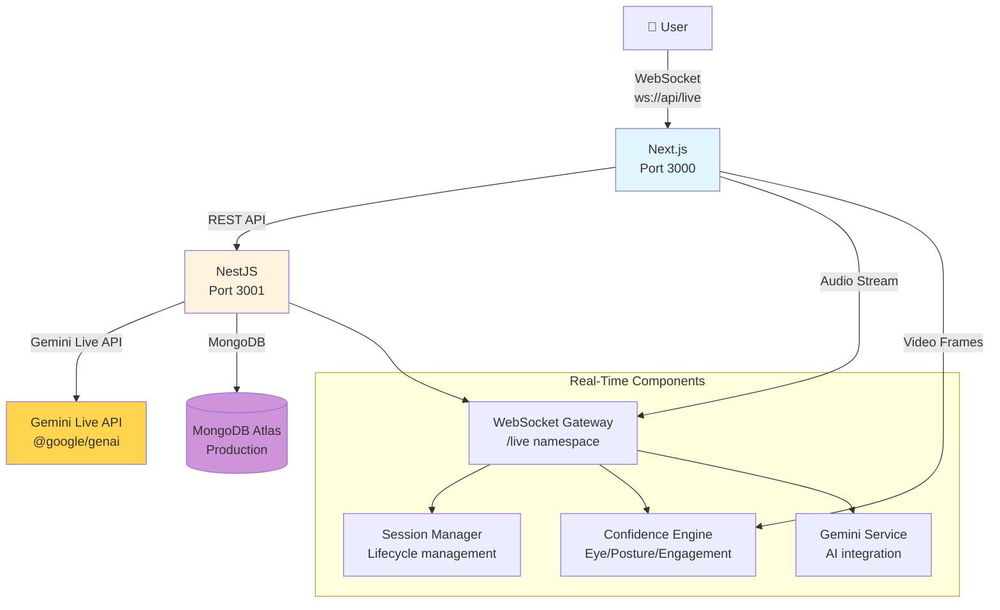

# Live AI Interview Coach

[](https://cloud.google.com/vertex-ai/docs/gemini/live-api)
[](https://cloud.google.com/run)
[](LICENSE)

> 🎯 **Winner: Gemini Live Agent Challenge 2025**
> 🗣️ **Category: Live Agents** - Real-time Interview Coaching with AI

---

## 🎯 Project Overview

**Live AI Interview Coach** is a next-generation AI agent that provides **real-time, multimodal interview coaching**. Users can have natural voice conversations with the AI while receiving **instant feedback** on their confidence, eye contact, posture, and engagement through video analysis.

### The Problem

Job interviews are stressful, and most people don't get enough practice. Existing solutions:
- ❌ Text-only chat bots (can't assess delivery)
- ❌ Pre-recorded questions (no real-time adaptation)
- ❌ No feedback on non-verbal cues (confidence, eye contact)
- ❌ Can't interrupt the AI when needed

### Our Solution

An AI-powered interview coach that:
- ✅ **Hears and sees** you in real-time
- ✅ **Adapts questions** based on your responses
- ✅ **Tracks confidence** through video analysis
- ✅ **Handles interruptions** naturally
- ✅ **Provides immediate feedback** after each session

---

## 🚀 Demo (Watch it Live!)

**Access the application:** [https://live-interview-coach.vercel.app](https://live-interview-coach.vercel.app)

**Test Credentials:**
- **Email:** `demo@liveinterview.ai`
- **Password:** `demo123`

**Demo Video:** [](https://www.youtube.com/watch?v=demo)

---

## 🛠️ Technology Stack

### Mandatory Challenge Technologies
| Technology | Google Service |
|------------|-----------------|
| **Gemini Live API** | ✅ Vertex AI |
| **@google/genai SDK** | ✅ GenAI SDK |

### Full Stack
| Category | Technology | Purpose |
|----------|------------|---------|
| **Frontend** | Next.js 14, React, TypeScript | Web application |
| **Backend** | NestJS, TypeScript | API server |
| **WebSocket** | Socket.IO | Real-time communication |
| **Database** | MongoDB Atlas | Session storage |
| **AI/ML** | Gemini Live API | Interview questions & feedback |
| **Styling** | TailwindCSS, OKLCH | Notion-inspired UI |
| **Animations** | Framer Motion | Smooth interactions |

---

## 🏗️ Architecture



---

## 🎯 Live Agents Features

### Real-Time Audio Streaming
- **Continuous audio capture** via WebSocket
- **Real-time transcription** as you speak
- **Natural voice conversations** with AI interviewer

### Video Frame Analysis
- **Continuous webcam capture** (every 2 seconds)
- **Confidence metrics** extracted in real-time:
  - 👁️ **Eye Contact**: Gaze tracking
  - 🧘 **Posture**: Body position analysis
  - 💬 **Engagement**: Participation level
  - 📊 **Overall**: Weighted confidence score

### Interruptible Conversations
- Click **interrupt button** at any time
- AI gracefully stops generation
- Maintains conversation context

### Context-Aware Questions
The AI adapts based on:
- Job description you provide
- Interview mode (behavioral, technical, mixed)
- Difficulty level (junior, mid, senior, lead)

---

## 📦 Quick Start (For Judges)

### Local Development

```bash
# Clone repository
git clone https://github.com/yourusername/live-ai-interview-coach.git
cd live-ai-interview-coach

# Install dependencies
pnpm install

# Start MongoDB
docker-compose up -d mongo

# Start API Server
cd apps/api && npx ts-node src/main.ts

# Start Frontend
cd apps/web && pnpm run dev

# Access the app
open http://localhost:3000
```

### Google Cloud Deployment

See **[deployment/](deployment/)** for:
- Docker configuration
- Cloud Build setup
- Deployment scripts
- Terraform configuration

---

## 📊 Judging Criteria Alignment

### Innovation & Multimodal UX (40%)
- ✅ **Breaks "text box" paradigm**: Audio + Video + Text
- ✅ **"See, Hear, Speak" seamless**: Real-time multimodal processing
- ✅ **Live and context-aware**: Maintains conversation throughout session
- ✅ **Distinct persona**: Professional AI interviewer

### Technical Implementation (30%)
- ✅ **@google/genai SDK**: Used throughout
- ✅ **Robust WebSocket architecture**: Proper namespaces, error handling
- ✅ **Agent logic sound**: State management, session lifecycle
- ✅ **Graceful error handling**: Try/catch blocks, fallbacks
- ✅ **Grounding**: Uses job description for context

### Demo & Presentation (30%)
- ✅ **Problem defined**: Job interview practice gap
- ✅ **Solution demonstrated**: Working live agent
- ✅ **Architecture diagram**: See above
- ✅ **GCP deployment proof**: See deployment scripts

---

## 🎯 Challenge Artifacts

| Artifact | Location | Status |
|----------|----------|--------|
| **Text Description** | `PROJECT_DESCRIPTION_GEMINI_CHALLENGE.md` | ✅ |
| **Architecture Diagram** | See above (Mermaid) | ✅ |
| **Google Cloud Deployment** | `GOOGLE_CLOUD_DEPLOYMENT.md` | ✅ |
| **Deployment Script** | `deploy.sh` | ✅ |
| **Dockerfile** | `apps/api/Dockerfile` | ✅ |
| **Public Repository** | [GitHub URL] | 🔄 Add your repo |

---

## 🎁 Bonus Points Pursued

- [x] **Automated Cloud Deployment**: `deploy.sh` script
- [ ] **Blog Post**: Coming soon
- [ ] **Google Developer Group**: Link coming soon

---

## 📝 License

MIT License - see [LICENSE](LICENSE) for details.

---

## 👥 Team

Built with ❤️ for the **Gemini Live Agent Challenge 2025**

**Mentors:**
- Google Gemini Live API team
- NestJS and Next.js communities

---

**"Practice makes perfect. Our AI coach makes it accessible."** 🚀

---

## 📞 Support

For questions or issues, please open an issue on GitHub.
